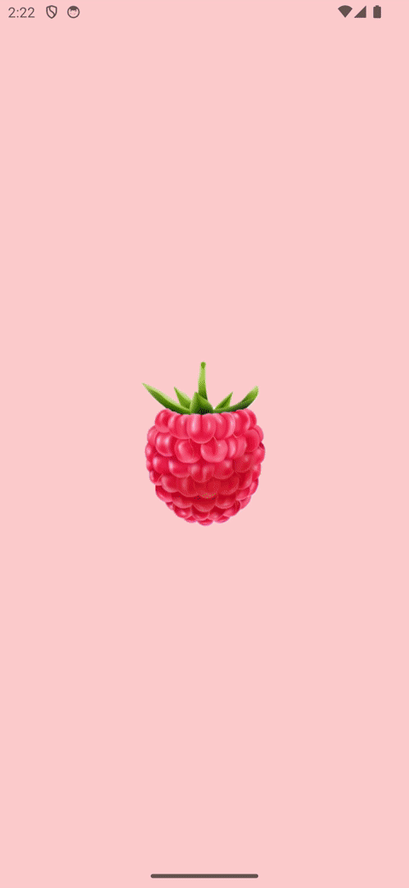
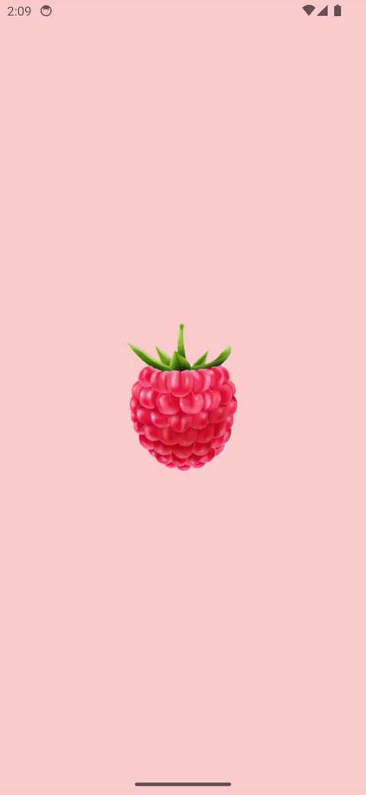

# FruitApp

This is an Android Compose app that fetches data from the a web API (https://www.fruityvice.com/). Response include a list with fruits and information about them. Those are presented in a scrollable list on the home page. Users can click on each of them to get all the data about the specific fruit and also add / remove it from favourites. Fruits that are added to favourites are saved in an internal Room database.

The project was developed by me (Petko Mikov) as a final exam for the course 76254A Engineering of Mobile Systems taught by Prof. Niccolò Pretto in the Free University of Bozen-Bolzano during the 1st semester of the 2023/24 study year.

## Usage

 
## Getting Started

To run the project, clonse the git repo and open it in Android Studio. No special Installation are neccesery, simply run it on a virtual or connected physical device

## Acknowledgements

FruitVice API: https://www.fruityvice.com/

Raspberry Logo: [Image by macrovector on Freepik]("https://www.freepik.com/free-vector/realistic-ripe-raspberry-berries-transparent-background-isolated-vector-illustration_37421621.htm#query=raspberry&position=1&from_view=search&track=sph&uuid=a905ee13-4062-4dee-9441-facdaee7ac2d")

## Contributing

The project is open to contribution. For any ideas or developed features that you see fit, email me at mikov.pm@gmail.com

## Project status

FruitApp developement is currently finished with no plans for future developement as of the writing of this text

## License

MIT License

Copyright (c) 2024 Petko Mikov

Permission is hereby granted, free of charge, to any person obtaining a copy
of this software and associated documentation files (the "Software"), to deal
in the Software without restriction, including without limitation the rights
to use, copy, modify, merge, publish, distribute, sublicense, and/or sell
copies of the Software, and to permit persons to whom the Software is
furnished to do so, subject to the following conditions:

The above copyright notice and this permission notice shall be included in all
copies or substantial portions of the Software.

THE SOFTWARE IS PROVIDED "AS IS", WITHOUT WARRANTY OF ANY KIND, EXPRESS OR
IMPLIED, INCLUDING BUT NOT LIMITED TO THE WARRANTIES OF MERCHANTABILITY,
FITNESS FOR A PARTICULAR PURPOSE AND NONINFRINGEMENT. IN NO EVENT SHALL THE
AUTHORS OR COPYRIGHT HOLDERS BE LIABLE FOR ANY CLAIM, DAMAGES OR OTHER
LIABILITY, WHETHER IN AN ACTION OF CONTRACT, TORT OR OTHERWISE, ARISING FROM,
OUT OF OR IN CONNECTION WITH THE SOFTWARE OR THE USE OR OTHER DEALINGS IN THE
SOFTWARE.
